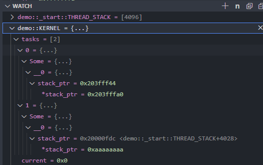

# Rust ARM RTOS playground

This personal *learning* project is an attempt to build a simple/naive RTOS for ARM Cortex-M microcontrollers in Rust.
Targeted microcontrollers are the `mps2_an385` (Cortex M3) platform and the `stm32f429zi` MCU (Cortex M4).
I've already worked on an RTOS for AVR 8 bits microcontrollers, written in C: <https://github.com/lucasdietrich/AVRTOS>

## Ressources

- [The embedonomicon](https://docs.rust-embedded.org/embedonomicon/preface.html)
- [A Practical guide to ARM Cortex-M Exception Handling](https://interrupt.memfault.com/blog/arm-cortex-m-exceptions-and-nvic)

- [QEMU / System Emulation / Generic Loader](https://www.qemu.org/docs/master/system/generic-loader.html)
- [crate: cortex_m_rt](https://docs.rs/cortex-m-rt/latest/cortex_m_rt/)
- [Embedded Systems Security and TrustZone](https://embeddedsecurity.io/)
- Inline assembly:
  - [**The Rust Reference: Inline assembly**](https://doc.rust-lang.org/reference/inline-assembly.html)
  - [Nightly: Inline assembly](https://doc.rust-lang.org/nightly/rust-by-example/unsafe/asm.html)
- [The Embedded Rust Book: Concurrency](https://docs.rust-embedded.org/book/concurrency/)

### Datasheets:

- [Procedure Call Standard for the ARM® Architecture](https://web.eecs.umich.edu/~prabal/teaching/resources/eecs373/ARM-AAPCS-EABI-v2.08.pdf)
- [Cortex-M3 Technical Reference Manual](https://documentation-service.arm.com/static/5e8e107f88295d1e18d34714?token=)
- [Deprecated Features in ARMv7-M](https://documentation-service.arm.com/static/5f8fedcbf86e16515cdbf30f?token=)

## Desired features

- [ ] Architecture: (`thumbv7em-none-eabihf`), devices:
    - [ ] mps2_an385 (ARM Cortex-M3 )
    - [ ] stm32f4xx (ARM Cortex-M4)

- [x] Cortex M3/M4 initialization
    - [x] RAM initialization
    - [x] Vector table
    - [x] Reset handler
    - [x] PendSV
      - [ ] Configure lowest priority (0b111)
    - [x] SVCall
      - [ ] Configure lowest priority (0b111)
    - [x] Systick
      - [ ] Configure highest priority (0b000)
    - [ ] Other interrupts
- [ ] Peripherals:
    - [ ] UART
      - [x] mps2_an385
      - [ ] stm32f4xx
- [ ] RTOS features:
    - [ ] stacks
        - [x] system stack
        - [ ] irq stack
        - [ ] user stack
    - [ ] MSP/PSP
    - [x] thread switch (without FPU support)
    - [x] cooperative scheduling
    - [ ] preemptive scheduling
    - [ ] sleep
    - [ ] mutex
    - [ ] semaphore
    - [ ] minimal drivers support for UART and GPIO
    - [x] syscalls:
        - [x] printf
        - [ ] sleep
        - [ ] fork
        - [ ] mutex
        - [ ] semaphore 
- [ ] Minimal process: load an application from an elf file and run it
    - [ ] parse elf file
    - [ ] toolchain for build the application (C/Rust + linker script + relocation? + syscalls)

## Questions/ideas/problems

TODO:

- use SVC for syscalls
- arm user vs system modes
- user / system / irq ? and stacks
- thread mode vs handler mode
- Target triplet ? `thumbv7em-none-eabihf`, or maybe `thumbv7m-none-eabi` is enough ?
- ~~understand why .data MYVAR is already initialized in QEMU~~ -> QEMU loads the .data section from the ELF file to RAM
- ~~understand why .data .bss appears in the ELF file~~ -> QEMU loads the .bss section from the ELF file to RAM
- Add the noinit section to the linker script
- If symbol gets wiped out of the elf, gdb won't find it, we need to force the symbol to be kept in the elf file -> how to ? (e.g. _thread_switch)

## Notes

### Static and const

```rs
const FOO: u32 = 42; // Const is a compile-time constant
static BAR: u32 = 42; // Static is a runtime constant
static mut BAZ: u32 = 42; // Static mutable 
```

### Export symbols

Disable name mangling for a function:

```rs

#[export_name = "switch_to_user"]
fn switch_to_user() {
    // ...
}

#[export_name = "my_symbol"]
extern "C" fn my_function() {
    // ...
}

```

### Links to a section
    
```rs
#[link_section = ".kvars"]
static mut BAZ: u32 = 42;
```

### Make static variable extern

In order to export the symbol of a static variable, it must be declared with `#[used]`:
The `no_mangle` attribute make sure the symbol name is not mangled by the compiler (e.g. demo::entry::z_current -> z_current)

```rs
#[used]
#[no_mangle]
pub static mut z_current: *mut Thread = core::ptr::null_mut();
```

### Rename symbol

!!! warning "TODO"
    What is bellow is probably wrong

`link_name` must only be used on statics and functions that are in an `extern` block.

```rs
extern "C" {
    #[link_name = "z_current"]
    static mut z_current: *mut Thread;
}
```

### Write ASM in rust code

Following inline assembly code is equivalent to the rust code:

```rs
use use core::arch::global_asm;
global_asm!(
    "
    .section .text, \"ax\"
    .global _pendsv
    .thumb_func
_pendsv:
    push {{r7, lr}}
    mov	r7, sp
    nop
    pop	{{r7, pc}}
    "
);

extern "C" {
    pub fn _pendsv();
}
```

Pure rust:

```rs
use use core::arch::asm;
#[no_mangle]
pub unsafe extern "C" fn _pendsv() {
    asm!("nop");
}
```

It's currently impossible to write naked functions in Rust, see <https://github.com/rust-lang/rust/issues/90957> for support for `#[naked]` functions.

### Static initialization

A static variable can be initialized using a `const` function:

```rs
pub struct Kernel;

impl Kernel {
    pub const fn init() -> Kernel {
        Kernel {}
    }
}

fn main() {
    static mut KERNEL: Kernel = Kernel::init();
}
```

### cortex-debug: Watch variables

If you want to watch a static rust variable, you need to use its full name, for example:



The full names can be found in the output of `nm`: e.g. `2000000c 00000014 d demo::KERNEL`

### PhantomData of non generic (TODO)

What is the purpose of `PhantomData` in the following code ?

```rs
pub struct SCB {
    _marker: PhantomData<*const ()>,
}
```

### Force inlining

Feel free to help the compiler to inline a function by using the `#[inline(always)]` attribute:

```rs
impl<D: CsDomain> Cs<D> {
    #[inline(always)]
    /* This is the only method to obtain a critical session object */
    pub unsafe fn new() -> Self {
        Cs {
            domain: PhantomData,
        }
    }
}
```
